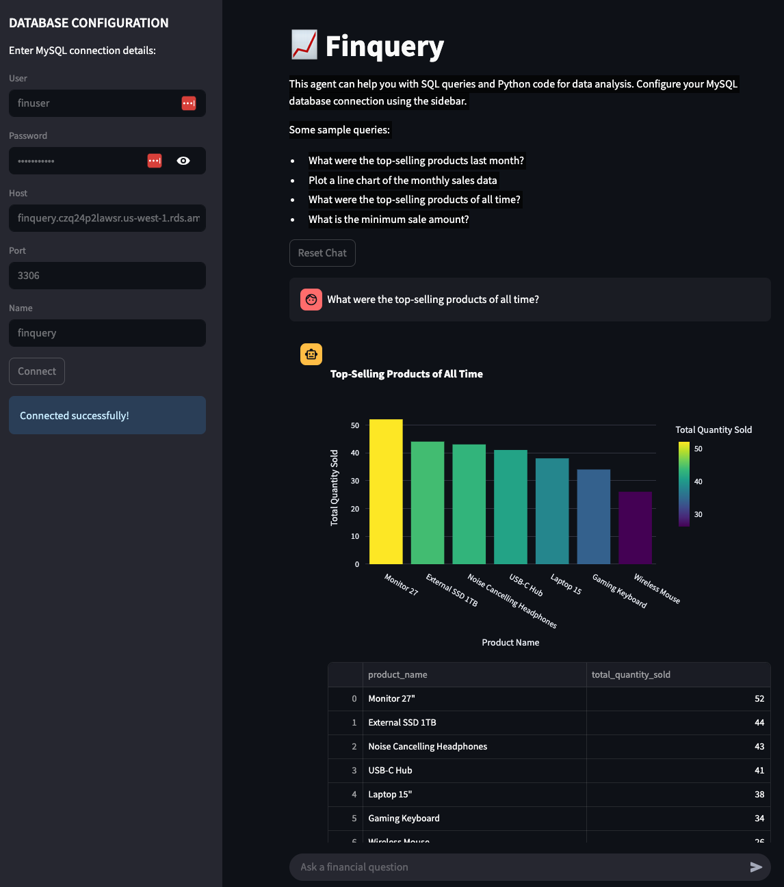

# finquery-streamlit
An AI-Powered Financial Query application.

You can try the app at <https://emelz.ai/finquery/>.

- [Overview](#overview)
- [Project Structure](#project-structure)
- [Get the project](#get-the-project)
- [Local laptop native setup](#local-laptop-native-setup)
- [Local Docker setup](#local-docker-setup)
- [Local k3d setup](#local-k3d-setup)
- [Data](#data)

## Overview
This app provides an intelligent financial agent that can help you answer questions about data stored in 
your private database.
You configure your MySQL database connection using the sidebar, and chat with the assistant.

### Example session


## Prerequisites
You should have a database with some financial data.
See the [Data](#data) section for instructions on settings up data in a local mysql database.

## Project structure
```aiignore
├── .gitignore                    - Files that git should ignore
├── .github 
│   └── workflows
│       └── cicd.yml              - CI/CD pipeline for testing, building, and deploying to prod 
├── Dockerfile                    - Instructions for building the docker image 
├── LICENSE
├── README.md                     - This file
├── data                          - Sample financial data
│   ├── Finance Dataset Description.docx
│   ├── accounting_transactions.csv
│   ├── financial_transactions.csv
│   └── sample_sales_data.csv
├── k8s
│   ├── deployment.yaml           - Configures volumes, initContainer for conf decryption, etc
│   ├── hostpath-pv.yaml          - Persistent Volume for reading conf and writing logs
│   ├── hostpath-pvc.yaml         - Persistent Volume Claim
│   ├── ingress.yaml              - Ingress to route requests to http://<clusterip>/finquery/
│   └── service.yaml              - Expose service on port 80
├── pyproject.toml                - Project file containing dependencies, tool configs, and project metadata
├── run.sh                        - Script for build and running docker in a dev environment
├── scripts
│   └── create_db.sql             - Script for setting up a mysql database with sample data
├── src
│   └── finquery_streamlit
│       ├── app.py                - Main streamlit app
│       ├── db_agent.py           - Agent for handling db interactions
│       ├── orchestrator.py       - Top-level agent used by clients that talks to other agents
│       ├── plotly_agent.py       - Agent for generating plotly visualizations
│       ├── presentation_agent.py - Agent for determining presentation style of output
│       └── settings.py           - Used for configuring connections to external resources
├── tests                         - Unit tests
│   ├── __init__.py
│   └── test_math.py
├── uv.lock                       - Locks dependencies for reproducible builds
└── var
    ├── conf
    │   └── finquery
    │       ├── .env.dev          - Configuration template for local (Pycharm) environment
    │       └── .env.dev.docker   - Configuration template for local docker environment
    └── log                       - Directory for log files
```
## Get the project
Find a suitable dir (such as `~/Data/code`) and:
```bash
cd ~/Data/code
rm -rf finquery-streamlit
git clone git@github.com:ericmelz/finquery-streamlit.git
cd finquery-streamlit
```

## Local laptop native setup
### Install uv if it's not already on your system

```bash
pip install uv
```

### Create and activate a virtual environment
```bash
uv venv
```

### Install dependencies, including development dependencies
```bash
uv pip install -e ".[dev]"
```

### Run tests
```bash
uv run pytest
```

### Configure
Copy the configuration template:
```bash
cp var/conf/finquery/.env.dev var/conf/finquery/.env
```
Edit `var/conf/finquery/.env` with your values

### Run the app
```bash
uv run streamlit run src/finquery_streamlit/app.py
^c
```

## Local Docker setup
### Configure
Copy the configuration template:
```bash
cp var/conf/finquery/.env.dev.docker var/conf/finquery/.env.docker
```
Edit `var/conf/finquery/.env-docker` with your values

### Build and run the docker image
```bash
./run.sh
```

### Hit the app
visit <http://localhost:8511>

## Local k3d setup
### Prerequisites
- Docker installed
- k3d installed (`curl -s https://raw.githubusercontent.com/k3d-io/k3d/main/install.sh | bash`)

### Record the configuration directory
```bash
VAR_DIR=$(pwd)/var
```
### Create a new k3d cluster
```bash
k3d cluster create finquery --api-port 6443 -p "8899:80@loadbalancer" --volume "$VAR_DIR:/mnt/var@server:0"
```

### Encrypt the configuration
The kubernetes environment assumes that configuration exists as 
gpg-encrypted .env files on your file system.  Do not store unencrypted credentials on your
file system.

Create a GPG_PASSPHRASE:
```bash
export GPG_PASSPHRASE=$(openssl rand -base64 32)
```

Encrypt your credentials: 
```bash
rm -f var/conf/finquery/.env.dev.gpg
cat var/conf/finquery/.env|gpg --symmetric --cipher-alg AES256 --batch --passphrase "$GPG_PASSPHRASE" -o var/conf/finquery/.env.dev.gpg
```

Note: you can decrypt your conf using
```bash
gpg --batch --yes --passphrase "$GPG_PASSPHRASE" -o var/conf/finquery/.env.dev.decrypted -d var/conf/finquery/.env.dev.gpg                          
```

### Build the Docker image and import it into the cluster
```bash
docker build -t finquery:latest .
k3d image import finquery:latest -c finquery
```

### Install the configuration encryption key
```bash
kubectl create secret generic gpg-passphrase --from-literal=GPG_PASSPHRASE=$GPG_PASSPHRASE
```

### Deploy to k3d
```bash
kubectl apply -f k8s/
```

### Verify deployment
```bash
kubectl get deployments
kubectl get pods
kubectl get ingress
```

### Access the service
visit http://localhost:8899/finquery/

### Destroy cluster
```bash
k3d cluster delete finquery
```

## Data
Sample data is provided in the `data` directory.

It can be loaded into a msyql instance by setting up environment variables
```bash
export ROOT_PASSWORD=YOUR_ROOT_PASSWORD
export USER_PASSWORD=YOUR_DB_USER_PASSWORD
```
and then executing:
```bash
cd scripts
envsubst < create_db.sql | mysql --local-infile=1 -uroot -p $ROOT_PASSWORD
```